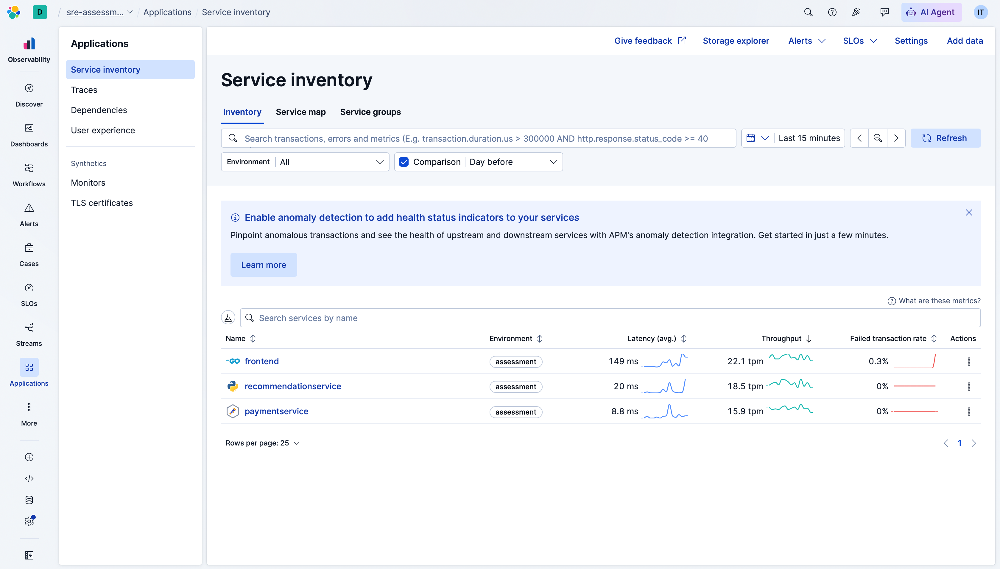
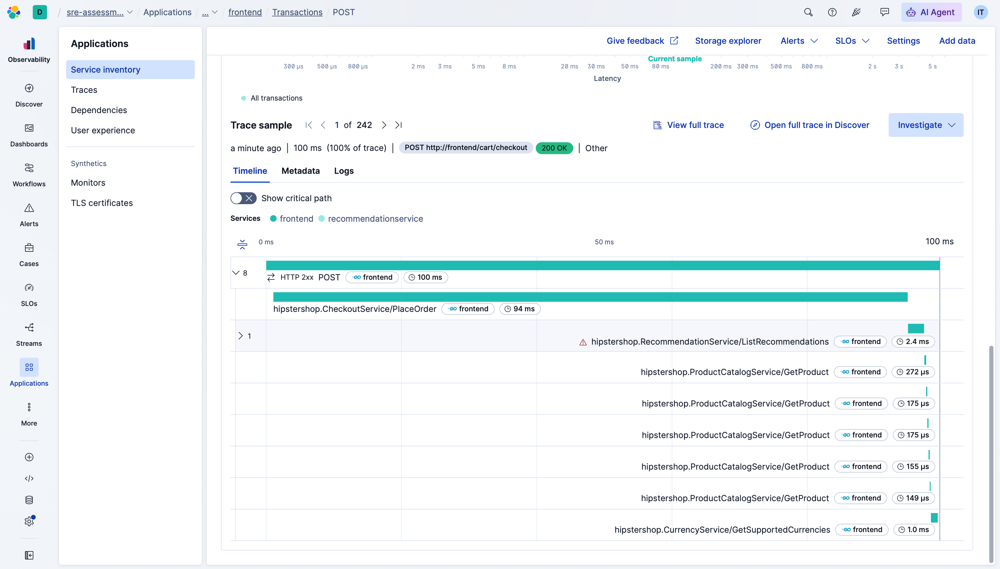
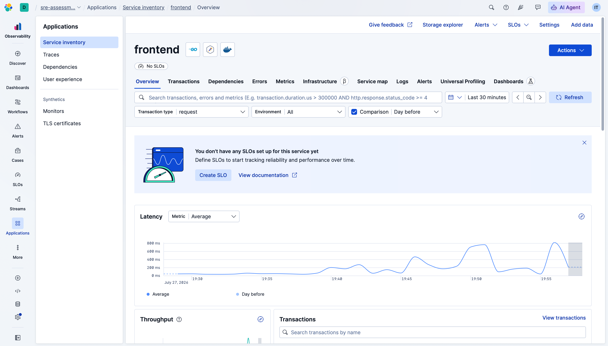
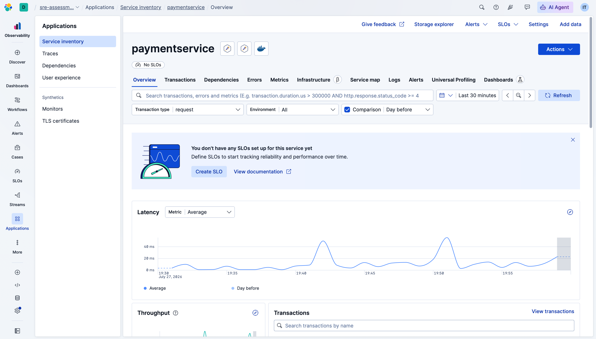
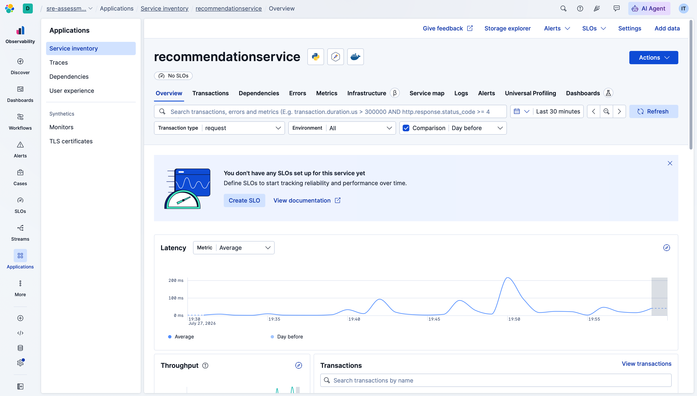
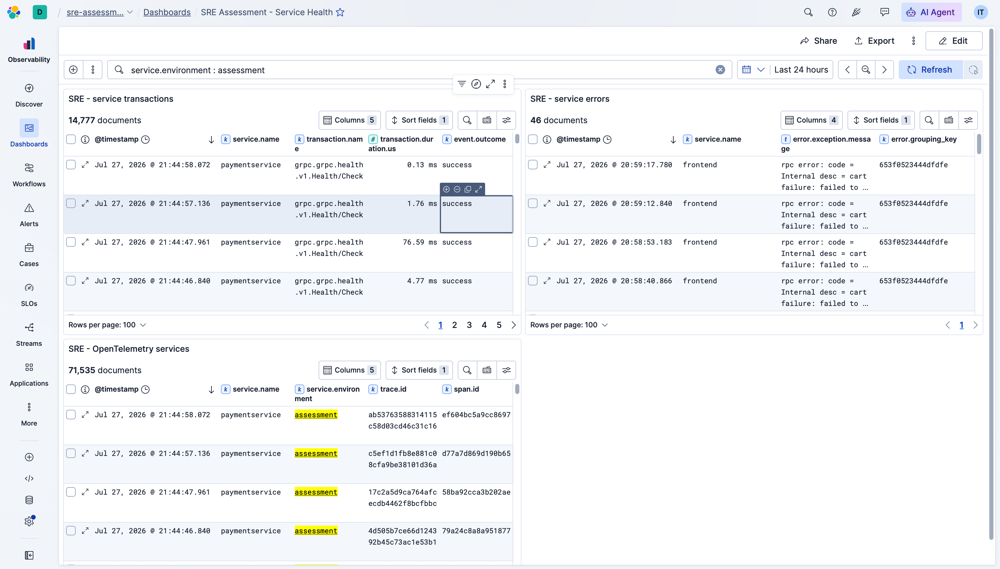
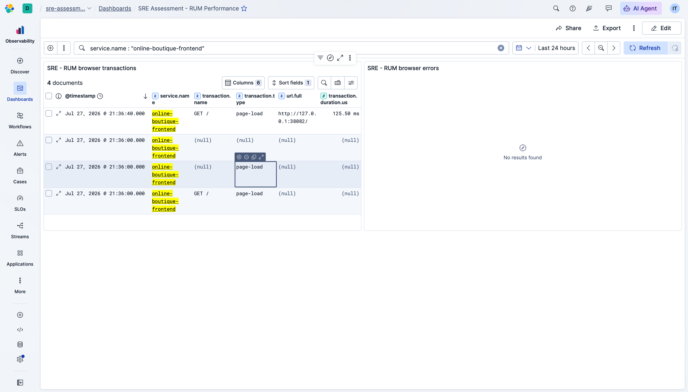
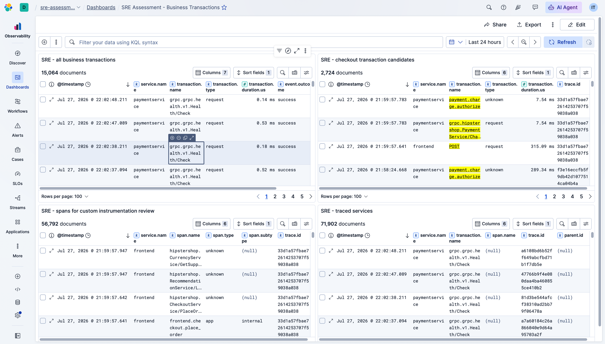

# Assessment Evidence Checklist

Use this file to capture the final proof points for the SRE assessment.

## Collector

- `kubectl get pods -n observability` shows healthy `otel-agent` DaemonSet pods.
- `kubectl get pods -n observability` shows healthy `otel-gateway` replicas.
- `kubectl logs -n observability deploy/otel-gateway-opentelemetry-collector` has no exporter authentication errors.
- Collector self-metrics are reachable on port `8888`.

## APM

- Kibana APM Services shows `frontend` after fresh traffic.
- Kibana APM Services shows `paymentservice` after checkout traffic.
- Fresh traces do not appear under `unknown_service` or `unknown_service_server`.
- Checkout trace contains frontend and payment spans.
- Error or slow transactions are retained by the gateway tail-sampling policy.

## Instrumentation

- `instrumentation/frontend/custom-checkout-span.patch` applies to the upstream `microservices-demo` checkout.
- `instrumentation/paymentservice/custom-charge-span.patch` applies to the upstream `microservices-demo` checkout.
- `instrumentation/frontend/rum-template.patch` applies to the upstream `microservices-demo` checkout.
- `rum/browser-rum.js` is copied to the frontend static assets as `static/rum.js` when rebuilding the frontend image.

## Kibana

- `dashboards/service-health.ndjson` imports successfully.
- `dashboards/rum-performance.ndjson` imports successfully.
- `dashboards/business-transactions.ndjson` imports successfully.
- The imported Kibana dashboards contain live saved-search panels backed by the APM data view.
- `infrastructure/alerting-rules/sre-alerts.ndjson` imports successfully.

## Review Talking Points

- Agent/gateway topology separates node-local telemetry intake from centralized export and sampling.
- API key authentication uses `Authorization: ApiKey ...`; APM secret tokens would use `Bearer ...`.
- Tail sampling keeps high-value traces while limiting storage growth from normal successful traffic.
- Explicit `OTEL_SERVICE_NAME` prevents OpenTelemetry fallback service names in Kibana.
- Source instrumentation is stored as patches because the upstream application checkout is not part of this assessment repo.

## Captured Evidence

### Generated Traffic

Fresh traffic was generated through browser browsing, add-to-cart, checkout, and curl requests against the port-forwarded frontend.

### Kubernetes

[Observability pods](./evidence/observability-pods.txt)

[Boutique pods](./evidence/boutique-pods.txt)

[Observability services](./evidence/observability-services.txt)

[Boutique services](./evidence/boutique-services.txt)

[Gateway error check](./evidence/gateway-errors.txt)

[Gateway log summary](./evidence/gateway-log-summary.txt)

[Live custom-span pod readiness](./evidence/live-custom-pods.txt)

[Live patched images and resources](./evidence/live-custom-images.txt)

[Live custom-span gateway error check](./evidence/live-custom-gateway-errors.txt)

[Live frontend checkout logs](./evidence/live-custom-frontend-checkout.txt)

[Live paymentservice charge logs](./evidence/live-custom-paymentservice.txt)

[Kibana dashboard import verification](./evidence/kibana-dashboard-import.txt)

[Elastic RUM intake verification](./evidence/rum-intake-verification.txt)

### Kibana APM

### Kibana Dashboards

